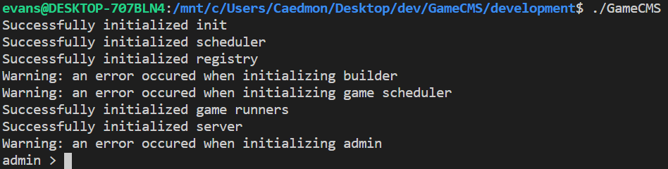

[Home](index.md) / [Tutorials](tutorials.md) / How to Run a Contest

# How to Run a Contest

In order to run a contest, you will need to learn how to host GameCMS contests. Running a contest is so simple that it only requires 2 steps.

1. If GameCMS is not already installed on your machine, [install it](setup.md).

2. Run the contest by typing ```./GameCMS``` into a shell. You should get something like this as output:


