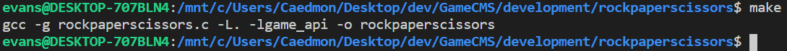

[Home](index.md) / [Tutorials](tutorials.md) / How to Create a Game Script

# How to Create a Game Script

## Introduction

In order to run a contest, we need to know what type of game we want our programs to compete in. If you have an idea for a game you want to implement, it would be a good idea to learn how to create a *game script*.

A game script is simply a file that runs the processes the game logic for the contest. If you want to have players compete in a racing game, then you define how you want the players to drive their vehicles in the game script. The game script is also responsible for assigning scores to players so that they be ranked at the end of the contest.

Thankfully, creating a game script is very simple. There are less than 20 functions that are used to create game scripts (those functions can be found [here](reference.md)). For this tutorial a rock, paper scissors game will be implemented with 30 rounds.

## The Tutorial

1. The first step, if you have not already, is to [set up your GameCMS environment](setup.md).

2. Next, you will need to create a new source file in your language of choice. The language you choose is important! It must be able to load a C library file and call those functions. This tutorial will write the game script in C, which is what GameCMS is written in. If you want to create a game script in another language, first make sure the language supports interoperability with C libraries and load the library into your program.

3. In order to make the building process easier, let's create a make file called ```Makefile```. In that file, copy and paste in the text below:

```make
CFLAGS = -Wall -Wextra -Werror

file: script.c libgame_api.so
	gcc $(CFLAGS) rockpaperscissors.c -L. -lgame_api -o rockpaperscissors
```

This will hide the complex command for us. Now, all we have to do is call ```make``` in a shell in order to build our game script.

4. Create a new file called ```rockpaperscissors.c``` and copy and past the following into that file:

```c

#include <string.h>
#include <stdlib.h>

#include "game_api.h"

// Transform a string into the correct numerical value
int strToInt(const char* str) {
	if (strcmp(str, "ROCK") == 0) return 0;
	else if (strcmp(str, "PAPER") == 0) return 1;
	else if (strcmp(str, "SCISSORS") == 0) return 2;
	else return -1;
}

int main(int argc, char** argv) {
	int p = GameAPI_initProcess(argv[1]);

	// Make sure we only have 2 players
	if (p != 2) {
		printf("Can only support 2 players!\n");
		exit(1);
	}

	/* Body of game script goes here */

	GameAPI_killProcess();
	
	return 1;
}
```

This is the basic template for a game script. ```GameAPI_initProcess()``` is the first function we should call in our program. This will initialize the player scripts for us along with other important information.

The conditional ```if (p != 2) { ... }``` checks if there are only two players present. If there are more or less than two players, then the program will throw an error because a game of rock, paper, scissors can only have 2 players.

```GameAPI_killProcess()``` terminates player scripts and cleans up any allocations that took place while we were running our game.

5. The next part for initializing our game is to open a replay file. Replay files are binary files that contain enough information about the internal state of the game to create a visual representation of what was going on during a game. For rock, paper, scissors we can use this information to animate two hands that perform the moves of the game.

```c
// Initialize the replay file
GameAPI_openReplay("rockpaperscissors");

// Notify that we are starting the game
printf("Starting the game\n");
```

The ```GameAPI_openReplay()``` call opens a new replay file called ```rockpaperscissors``` and prepares it for writing. The ```printf()``` function is used to notify the admininistrator that a game is starting (mainly for debugging reasons).

6. Next, add the following code under what you pasted in step 5.

```c
// Run 300 games
for (int i = 0; i < 30; ++i) {

	// Signal the players we are ready for input
	GameAPI_playerBatchWrite("Rock, paper, scissors, shoot!\n", 1);

	// Read the inputs for both players
	char *p1s = GameAPI_playerRead(0);
	char *p2s = GameAPI_playerRead(1);

	// Make sure both players didn't time out
	if (!p1s) {
		printf("P1 timed out\n");
		GameAPI_playerSetScoreTo(0, 0);
		break;
	}
	if (!p2s) {
		printf("P2 timed out\n");
		GameAPI_playerSetScoreTo(1, 0);
		break;
	}

	/* Rest of for loop goes here */

}
```

For our purposes, a single game of rock, paper, scissors will consist of 30 rounds. Whoever wins the most rounds will declared the winner.

The ```GameAPI_playerBatchWrite()``` call sends out the message ```"Rock, paper, scissors, shoot!\n"``` to all processes involved in the game.

The next two lines deal with getting input from the player processes by using ```GameAPI_playerRead()```. After both player inputs are received, they are checked in the next two if statements to make sure that they are valid.

7. Now, we need to take those user inputs and transform them into readable information that we can use. Copy and paste the following below what you did in step 6:

```c
// Remove the newline character from the player's output
p1s[strlen(p1s) - 1] = '\0';
p2s[strlen(p2s) - 1] = '\0';

// Log the player's responses
printf("%s vs. %s\t", p1s, p2s);

// Transform the outputs to numerical values
int p1 = strToInt(p1s);
int p2 = strToInt(p2s);

// Make sure both players are still running
if (!GameAPI_isPlayerRunning(0)) {
	printf("Early exit... player 2 won\n");
	exit(0);
}
if (!GameAPI_isPlayerRunning(1)) {
	printf("Early exit... player 1 won\n");
	exit(0);
}
```

The first two lines in this listing are removing newline characters from the user inputs (GameCMS does not take care of this yet). On the next line, ```printf()``` is used for more debugging purposes.

On the two lines with the ```strtoInt()``` function call, these transform the string input into a numerical representation that is easier to perform calculations on.

Lastly, the last two if statements check if either player process is still running. If one of them stops, then the other player is declared the winner and the game process stops.

8. The next step in making a game is to decide who won and record those results. To do so, copy and past the code below under what you pasted in step 7.

```c
unsigned char replayValue[3];
replayValue[0] = p1;
replayValue[1] = p2;

// If both players performed the same action
if (p1 == p2) {
	puts("Tie");
	GameAPI_playerBatchWrite("Tie\n", 0);
	replayValue[2] = 0b00;
}
else if (p1 == p2 - 1 || p1 == p2 + 2) {
	puts("Player 2 won");
	GameAPI_playerWrite(0, "You lost\n", 0);
	GameAPI_playerWrite(1, "You won\n", 0);
	GameAPI_playerChangeScoreBy(1, 1);
	replayValue[2] = 0b10;
}
else {
	puts("Player 1 won");
	GameAPI_playerWrite(0, "You won\n", 0);
	GameAPI_playerWrite(1, "You lost\n", 0);
	GameAPI_playerChangeScoreBy(0, 1);
	replayValue[2] = 0b01;
}

GameAPI_replayWrite(replayValue, sizeof(replayValue));
GameAPI_replayPushFrame();

fflush(stdout);
```

First an ```unsigned char``` array named ```replayValue``` is declared. This array will hold the output of the first player, the output of the second player, and the winner of the round in the order.

The next block now works out the actual logic of the game:
* Players who win the round will have their score incremented by one.
* If both players choose the same action (like both choose rock), then no one gets a point and the next round is played.
* The winner of the round is recorded in the last entry of the ```replayValue``` array.

The last three lines of the code sample write the array to the replay file and then flush the data so no information is lost.

9. We are now done with writing the code. All that needs to be done now is building the game script. Just call ```make``` in a shell in the same directory as the game file and you will be finished. You should see something like the image below:



## Conclusion

Game scripts are vital to get a contest running in GameCMS. The example game script given in this tutorial can be expanded to add new features or even create an entirely new game.

If you are wondering what to do next check out [How to Run a Contest](tutorial_contest.md)
